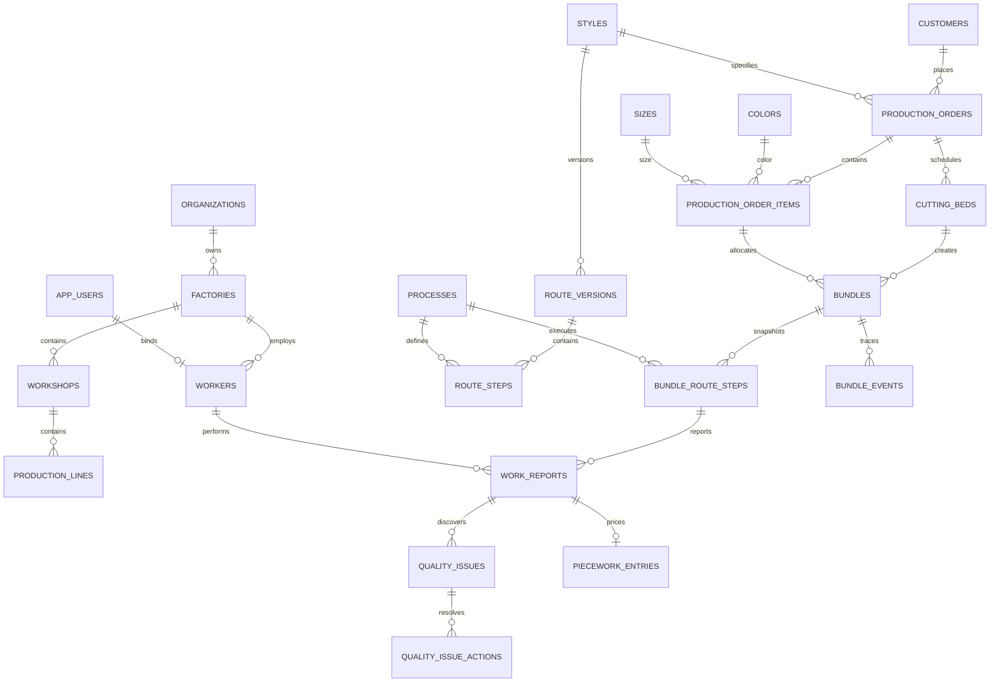

# 服装扎包生产管理系统数据库设计

- 数据库：PostgreSQL 15+
- 字符集：UTF-8
- 时区：数据库保存 `timestamptz`，应用按工厂时区显示
- 主键：UUID（`gen_random_uuid()`）
- 设计目标：可追溯、强数量约束、报工幂等、工艺版本隔离、支持多工厂数据隔离
- 配套 DDL：`/Users/ross/.kiro/crew/workspace/database/schema.sql`

## 1. 设计原则

1. **生产事实只追加，不静默覆盖**：完工、质量、计件和审计记录保留历史；更正通过冲销/调整实现。
2. **扎包路线快照**：扎包创建时从款式工艺路线复制步骤，保证模板升级不影响在制品。
3. **服务端强约束**：唯一性、数量非负、状态范围和关键防重由数据库保证，不只依赖前端。
4. **事务一致性**：完工报工、步骤更新、下一步解锁、事件和计件快照在一个事务内提交。
5. **幂等优先**：所有移动端写请求带 `request_id`，数据库唯一约束避免弱网重试产生重复数据。
6. **多工厂隔离**：核心业务表保存 `factory_id`；应用查询必须带工厂范围，可进一步启用 RLS。
7. **不暴露顺序 ID**：二维码使用独立随机 Token 哈希，外部接口使用 UUID 或短码。

## 2. 逻辑分域

| 分域 | 主要表 |
|---|---|
| 组织与权限 | `organizations`, `factories`, `workshops`, `production_lines`, `app_users`, `roles`, `user_roles`, `workers` |
| 产品与工艺 | `customers`, `styles`, `colors`, `sizes`, `processes`, `route_versions`, `route_steps` |
| 订单与裁床 | `production_orders`, `production_order_items`, `cutting_beds` |
| 扎包与路线 | `bundles`, `bundle_route_steps`, `bundle_relations`, `print_jobs`, `print_job_items` |
| 报工与质量 | `work_reports`, `quality_issues`, `quality_issue_actions` |
| 计件 | `piece_rates`, `piecework_entries` |
| 追溯与审计 | `bundle_events`, `audit_logs`, `idempotency_records` |

## 3. 核心实体关系



## 4. 通用字段约定

- `id uuid`：主键；
- `factory_id uuid`：数据归属工厂；
- `created_at timestamptz`、`updated_at timestamptz`：创建和更新时间；
- `created_by uuid`、`updated_by uuid`：操作者，必要时允许系统任务为空；
- `version integer`：乐观锁版本，更新时执行 `WHERE id=? AND version=?`；
- `deleted_at timestamptz`：仅用于允许软删除的主数据；生产事实不使用删除；
- 金额使用 `numeric(14,4)`，数量使用 `integer`，不使用浮点数；
- 业务状态使用 `varchar + CHECK`，便于后续扩展和跨系统映射；
- 业务日期使用 `date`，事实时间使用 `timestamptz`。

## 5. 表设计

### 5.1 `organizations` 集团/租户

| 字段 | 类型 | 约束/说明 |
|---|---|---|
| id | uuid | PK |
| code | varchar(40) | 全局唯一 |
| name | varchar(120) | 非空 |
| status | varchar(20) | ACTIVE/INACTIVE |
| created_at, updated_at | timestamptz | 非空 |

### 5.2 `factories` 工厂

| 字段 | 类型 | 约束/说明 |
|---|---|---|
| id | uuid | PK |
| organization_id | uuid | FK organizations |
| code | varchar(40) | 组织内唯一 |
| name | varchar(120) | 非空 |
| timezone | varchar(50) | 默认 Asia/Shanghai |
| status | varchar(20) | ACTIVE/INACTIVE |

### 5.3 `workshops` / `production_lines`

分别表示车间和生产线。生产线属于车间，编码在对应父级内唯一。保留 `status`、审计时间和可选负责人。

### 5.4 `app_users`, `roles`, `user_roles`

- `app_users`：登录账号、密码哈希、显示名、手机号、状态、最后登录时间；账号在组织内唯一。
- `roles`：角色编码、名称、权限 JSONB、数据范围。
- `user_roles`：用户与角色多对多，可限定 `factory_id`。
- 密码/PIN 只保存 Argon2id/bcrypt 哈希。

### 5.5 `workers` 工人

| 字段 | 类型 | 约束/说明 |
|---|---|---|
| id | uuid | PK |
| factory_id | uuid | FK factories |
| user_id | uuid | 可空，绑定登录账号 |
| worker_no | varchar(40) | 工厂内唯一 |
| name | varchar(80) | 非空 |
| pin_hash | text | 可空，不存明文 |
| workshop_id, production_line_id | uuid | 当前归属 |
| status | varchar(20) | ACTIVE/INACTIVE/LEFT |
| hired_on, left_on | date | 可空 |

工人技能建议后续增加 `worker_skills(worker_id, process_id, level, effective_from, effective_to)`。

### 5.6 `customers`, `styles`, `colors`, `sizes`, `processes`

主数据均按工厂隔离并使用业务编码：

- `customers`：客户编码、名称；
- `styles`：款式编码、客户款号、名称、图片地址、版本；
- `colors`：颜色编码、名称、显示顺序；
- `sizes`：尺码编码、名称、显示顺序；
- `processes`：工序编码、名称、单位、默认标准秒数、默认计件价、状态。

### 5.7 `route_versions` 款式工艺路线版本

| 字段 | 类型 | 约束/说明 |
|---|---|---|
| id | uuid | PK |
| factory_id | uuid | FK factories |
| style_id | uuid | FK styles |
| version_no | integer | 款式内唯一且 > 0 |
| status | varchar(20) | DRAFT/PUBLISHED/RETIRED |
| effective_from | date | 可空 |
| published_at, published_by | 时间/用户 | 发布信息 |

同一款式可有多个版本，但建议业务层只允许一个当前生效版本。

### 5.8 `route_steps` 路线模板步骤

| 字段 | 类型 | 约束/说明 |
|---|---|---|
| route_version_id | uuid | FK route_versions |
| step_no | integer | 版本内唯一 |
| process_id | uuid | FK processes |
| is_required | boolean | 默认 true |
| is_quality_gate | boolean | 是否质检点 |
| allow_parallel | boolean | 是否可与相邻步骤并行 |
| standard_seconds | integer | 单件标准秒数 |
| piece_rate | numeric(14,4) | 模板参考单价 |

复杂依赖可扩展 `route_step_dependencies(step_id, prerequisite_step_id)`；MVP 默认按 `step_no` 串行。

### 5.9 `production_orders` 生产订单

| 字段 | 类型 | 约束/说明 |
|---|---|---|
| id | uuid | PK |
| factory_id | uuid | FK factories |
| order_no | varchar(60) | 工厂内唯一 |
| customer_id | uuid | FK customers，可空 |
| style_id | uuid | FK styles |
| status | varchar(20) | DRAFT/RELEASED/IN_PROGRESS/COMPLETED/CANCELLED |
| planned_start_date | date | 可空 |
| due_date | date | 可空 |
| total_planned_qty | integer | > 0，与明细汇总校验 |
| external_ref | varchar(100) | ERP 外部编号 |
| version | integer | 乐观锁 |

### 5.10 `production_order_items` 订单颜色尺码明细

| 字段 | 类型 | 约束/说明 |
|---|---|---|
| order_id | uuid | FK production_orders |
| line_no | integer | 订单内唯一 |
| color_id | uuid | FK colors |
| size_id | uuid | FK sizes |
| dye_lot_no | varchar(60) | 缸号，可空 |
| planned_qty | integer | > 0 |
| overproduction_limit | integer | 默认 0 |

同订单下 `(color_id, size_id, dye_lot_no)` 建议唯一；若业务允许重复，则以 `line_no` 区分。

### 5.11 `cutting_beds` 裁床床次

| 字段 | 类型 | 约束/说明 |
|---|---|---|
| factory_id | uuid | FK factories |
| order_id | uuid | FK production_orders |
| bed_no | varchar(40) | 工厂内唯一或按日期唯一 |
| cut_date | date | 非空 |
| ply_count | integer | 铺布层数，可空 |
| dye_lot_no | varchar(60) | 缸号，可空 |
| status | varchar(20) | DRAFT/CUTTING/CUT/RELEASED/CANCELLED |
| supervisor_worker_id | uuid | 可空 |

### 5.12 `bundles` 扎包

| 字段 | 类型 | 约束/说明 |
|---|---|---|
| id | uuid | PK |
| factory_id | uuid | FK factories |
| order_id | uuid | 冗余归属，便于隔离和查询 |
| order_item_id | uuid | FK production_order_items |
| cutting_bed_id | uuid | FK cutting_beds |
| route_version_id | uuid | 生成时使用的路线版本 |
| bundle_no | varchar(80) | 工厂内永久唯一 |
| bundle_seq | integer | 床次内扎号，唯一 |
| short_code | varchar(12) | 工厂内唯一、人工输入用 |
| qr_token_hash | char(64) | SHA-256 哈希，唯一；原 Token 不落库 |
| planned_qty | integer | 原计划数量，> 0 |
| effective_qty | integer | 调整后的有效数量，≥ 0 |
| completed_qty | integer | 最末工序确认数量，≥ 0 |
| status | varchar(20) | CREATED/IN_PROGRESS/BLOCKED/COMPLETED/CANCELLED/SPLIT/MERGED |
| current_step_no | integer | 当前步骤缓存，可空 |
| current_workshop_id, current_line_id | uuid | 当前区域，可空 |
| blocked_reason | text | BLOCKED 时填写 |
| printed_count | integer | 默认 0 |
| version | integer | 乐观锁 |

颜色、尺码、缸号通过 `order_item_id` 取得；若订单明细允许后续改变，可在扎包表增加字段快照。

二维码解析流程：接收原 Token → SHA-256 → 按 `qr_token_hash` 查询。Token 建议使用 128 bit 以上 CSPRNG，并以 Base64URL/Base32 编码。

### 5.13 `bundle_route_steps` 扎包路线快照

| 字段 | 类型 | 约束/说明 |
|---|---|---|
| bundle_id | uuid | FK bundles |
| source_route_step_id | uuid | 来源模板步骤，可空 |
| step_no | integer | 扎包内唯一 |
| process_id | uuid | FK processes |
| process_code_snapshot | varchar(40) | 生成时快照 |
| process_name_snapshot | varchar(120) | 生成时快照 |
| is_required, is_quality_gate | boolean | 快照 |
| standard_seconds | integer | 快照 |
| piece_rate_snapshot | numeric(14,4) | 参考单价快照 |
| input_qty, good_qty, defect_qty, missing_qty | integer | 累计数量，均非负 |
| status | varchar(20) | PENDING/READY/STARTED/BLOCKED/COMPLETED/SKIPPED/CANCELLED |
| started_at, completed_at | timestamptz | 可空 |
| version | integer | 乐观锁 |

第一必需步骤生成时为 `READY`，其余为 `PENDING`。返工步骤可使用 `is_rework`、`rework_of_step_id` 扩展字段，DDL 已预留。

### 5.14 `work_reports` 报工

| 字段 | 类型 | 约束/说明 |
|---|---|---|
| factory_id | uuid | 数据隔离 |
| request_id | uuid | 工厂内唯一，客户端幂等键 |
| bundle_id | uuid | FK bundles |
| bundle_route_step_id | uuid | FK bundle_route_steps |
| worker_id | uuid | FK workers |
| workshop_id, production_line_id | uuid | 实际作业位置 |
| status | varchar(20) | STARTED/COMPLETED/CANCELLED/REVERSED |
| input_qty | integer | 投入数 |
| good_qty | integer | 良品数 |
| defect_qty | integer | 次品数 |
| missing_qty | integer | 短缺数 |
| started_at | timestamptz | 服务器开工时间 |
| completed_at | timestamptz | 服务器完工时间 |
| client_started_at, client_completed_at | timestamptz | 客户端时间，可空 |
| device_id | varchar(100) | 可空 |
| unit_rate_snapshot | numeric(14,4) | 完工时价格快照 |
| notes | text | 可空 |
| correction_of_id | uuid | 更正/冲销关联原记录 |

约束：

- 所有数量非负；
- 完成时满足 `input_qty = good_qty + defect_qty + missing_qty`；
- 同一工厂 `request_id` 唯一；
- 同一步骤最多一条有效 `STARTED` 记录（部分唯一索引）；
- `completed_at >= started_at`。

### 5.15 `quality_issues` 与 `quality_issue_actions`

`quality_issues` 保存扎包、步骤、报工、发现人、缺陷代码、数量、严重度、责任步骤/工人、状态和图片附件 JSONB。状态：`OPEN/IN_REVIEW/REWORK/RELEASED/SCRAPPED/CLOSED`。

`quality_issue_actions` 以追加方式保存每次处理：动作 `COMMENT/ASSIGN/REWORK/RELEASE/SCRAP/CLOSE/REOPEN`、处理数量、操作人、时间和备注。

### 5.16 `piece_rates` 与 `piecework_entries`

- `piece_rates`：工厂、款式（可空表示通用）、工序、单价、生效起止日期，生效区间不得重叠（业务层或排斥约束）。
- `piecework_entries`：每条已完成报工对应的计件事实，保存工人、数量、单价快照、金额、结算状态和调整关联。
- 金额由服务端计算，`amount = quantity × unit_rate`。
- 状态：`PENDING/CONFIRMED/SETTLED/REVERSED`。

### 5.17 `print_jobs` 与 `print_job_items`

- `print_jobs`：打印批次、模板、打印机、状态、发起人和错误信息；
- `print_job_items`：打印批次中的扎包、份数、是否补打、补打原因、打印完成时间；
- 每次成功打印后增加 `bundles.printed_count`，并写 `bundle_events`。

### 5.18 `bundle_events`

不可变的扎包业务时间轴：

| 字段 | 类型 | 说明 |
|---|---|---|
| bundle_id | uuid | 扎包 |
| event_type | varchar(40) | CREATED/PRINTED/STARTED/COMPLETED/BLOCKED/UNBLOCKED/QUALITY/ADJUSTED/SPLIT/MERGED 等 |
| event_at | timestamptz | 服务器时间 |
| actor_user_id, actor_worker_id | uuid | 操作者 |
| work_report_id | uuid | 关联报工，可空 |
| payload | jsonb | 事件补充数据，只存非敏感快照 |

事件表不作为唯一业务真相来源；业务真相仍在规范化表中，事件表用于追溯和集成发布。

### 5.19 `audit_logs`

记录管理操作和敏感查询：对象类型/ID、动作、操作人、请求 ID、IP、User-Agent、修改前后 JSONB、原因和时间。禁止更新或删除。

### 5.20 `idempotency_records`

用于除报工外的通用写接口：工厂、请求 ID、接口作用域、请求体哈希、响应状态/响应体、过期时间。相同请求 ID 但请求体哈希不同必须拒绝。

### 5.21 `bundle_relations`

保存拆分/合并谱系：`source_bundle_id`、`target_bundle_id`、`relation_type`、`qty`、原因和操作人。原扎包进入 `SPLIT`/`MERGED` 终态，新扎包使用新的二维码。

## 6. 关键索引

除主键和唯一约束外，建议：

```sql
CREATE INDEX idx_bundles_order_status
  ON bundles (factory_id, order_id, status);

CREATE INDEX idx_bundles_current_step
  ON bundles (factory_id, current_step_no, status)
  WHERE status IN ('CREATED', 'IN_PROGRESS', 'BLOCKED');

CREATE INDEX idx_bundle_steps_process_status
  ON bundle_route_steps (factory_id, process_id, status);

CREATE INDEX idx_work_reports_worker_completed
  ON work_reports (factory_id, worker_id, completed_at DESC)
  WHERE status = 'COMPLETED';

CREATE INDEX idx_bundle_events_timeline
  ON bundle_events (bundle_id, event_at, id);

CREATE INDEX idx_quality_open
  ON quality_issues (factory_id, status, created_at)
  WHERE status NOT IN ('CLOSED', 'SCRAPPED');
```

高增长表 `work_reports`、`bundle_events`、`audit_logs` 达到千万级后，可按月或季度对 `event_at/created_at` 范围分区。不要在数据量很小时过早分区。

## 7. 数据一致性与事务

### 7.1 完工事务

建议隔离级别 `READ COMMITTED`，对目标 `bundle_route_steps` 和 `bundles` 执行 `SELECT ... FOR UPDATE`：

1. 查 `request_id`，已存在则返回原结果；
2. 锁定步骤和扎包；
3. 校验状态、前置步骤和数量；
4. 将报工由 STARTED 更新为 COMPLETED；
5. 累加步骤数量并设置 COMPLETED；
6. 创建质量问题（如有）；
7. 解锁下一必需步骤；
8. 若最后步骤完成，更新 `bundles.completed_qty/status`；
9. 生成 `piecework_entries`；
10. 写 `bundle_events` 和 `audit_logs`；
11. 提交事务。

并发更新使用行锁与 `version` 双重防护。聚合数量以原始完成报工为依据，缓存字段可重算。

### 7.2 订单进度

不要在订单表仅保存不可验证的百分比。实时/准实时进度来源：

- 分母：`production_order_items.planned_qty` 汇总；
- 分子：关联扎包最后一道必需步骤的确认良品数，但每扎不超过 `effective_qty`；
- 可使用物化视图或异步汇总表加速；
- 汇总表必须能从事实表重建。

### 7.3 数量守恒

应用服务在锁内校验：

```text
本次投入 = 本次良品 + 本次次品 + 本次短缺
步骤累计投入 ≤ 扎包有效数量 + 已批准补片数量
最后工序累计良品 ≤ 扎包有效数量
订单完成数量 = 各有效扎包末工序良品数之和
```

数据库 CHECK 负责单行非负与等式；跨行累计约束由事务服务负责。

## 8. 二维码和短码

1. 服务端生成 16~32 字节 CSPRNG Token；
2. 卡片打印 `https://域名/b/{token}`；
3. 数据库仅保存 `SHA-256(token)`，避免数据库泄露后二维码立即可用；
4. `short_code` 使用无歧义字符集（去除 0/O、1/I），长度建议 6~10 位；
5. Token 可吊销：增加 `qr_revoked_at` 并生成新 Token；
6. 短码查询按 IP、设备、用户限流，成功后仍需工人登录；
7. 日志只记录 Token 前缀或哈希，不记录完整 URL。

## 9. 数据权限与 RLS 建议

应用层所有核心查询必须注入 `factory_id`。如安全要求较高，可启用 PostgreSQL Row Level Security：

```sql
ALTER TABLE bundles ENABLE ROW LEVEL SECURITY;
CREATE POLICY bundles_factory_policy ON bundles
USING (factory_id = current_setting('app.factory_id')::uuid);
```

连接池每个事务开始时设置 `SET LOCAL app.factory_id = '...'`。超级管理员和后台任务使用独立数据库角色，不与普通 API 共用。

## 10. 数据保留与备份

| 数据 | 建议保留期 |
|---|---:|
| 订单、扎包、报工、质量、计件 | ≥ 7 年或按当地法规/合同 |
| 审计日志 | ≥ 3 年 |
| 接口幂等响应 | 7~30 天 |
| 一般应用日志 | 90~180 天 |
| 图片附件 | 按质量追溯要求，建议 ≥ 2 年 |

数据库使用每日全量 + 连续 WAL；附件存对象存储，数据库只保存对象键、哈希、大小和 MIME 类型。定期执行恢复演练。

## 11. 数据迁移和初始化顺序

1. 启用 `pgcrypto`；
2. 创建组织、工厂、车间和生产线；
3. 创建权限与用户；
4. 导入员工、客户、颜色、尺码、工序和款式；
5. 导入并发布款式工艺路线；
6. 导入未完成订单；
7. 从切换日开始生成新扎包；旧扎包可录入“期初在制品”并标注来源；
8. 对订单计划数、已分扎数和现场实物进行三方核对。

## 12. DDL 使用说明

`/Users/ross/.kiro/crew/workspace/database/schema.sql` 提供第一阶段核心表、约束和索引，可作为迁移工具（Flyway、Liquibase、Prisma、TypeORM 等）的基线。上线前仍需：

- 根据最终登录方案完善账号表；
- 根据工厂实际工序确认并行/返工模型；
- 决定是否开启 RLS；
- 增加 `updated_at` 自动更新触发器或由 ORM 维护；
- 为事件发布采用 Outbox 表（如需与 ERP/消息队列集成）；
- 使用真实数据执行并发、数量守恒和恢复测试。
