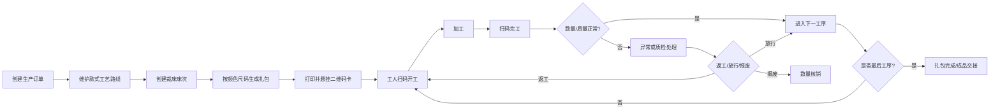

# 服装扎包生产管理系统（MES/WIP）产品需求规格

- 文档版本：1.0
- 文档状态：需求基线草案
- 适用对象：工厂负责人、生产主管、裁床主管、组长、工人、质检、财务、研发与测试
- 系统定位：管理服装从裁床扎包到成品入库的在制品（WIP）流转、扫码报工、质量追溯和计件数据

## 1. 项目背景

工厂将同款、同色、同码的一定数量裁片捆成一扎（下称“扎包”或“衣叠”），并附一张纸质流转卡。当前依赖人工填写、口头交接或电子表格，容易出现：

- 无法实时知道每扎位于哪个工序、由谁加工；
- 工序名称填写不统一，统计口径混乱；
- 漏报、重复报工、少片、丢扎、长时间滞留难以及时发现；
- 订单进度依赖人工汇总，数据滞后；
- 计件工资和质量责任缺少可信依据；
- 出现返工时无法快速追溯原操作工人和工序。

本系统通过“一扎一码”，为每个扎包建立唯一数字身份。工人扫描卡片二维码完成领取、开工、完工、异常和返工报工；管理人员在后台实时查看订单、款式、工序、班组和工人的生产状态。

> 名词说明：本系统更接近服装 MES/WIP 系统，可与现有 ERP 对接；ERP 继续负责客户、订单、采购、库存和财务主账。

## 2. 建设目标与成功指标

### 2.1 建设目标

1. 每扎衣服拥有唯一二维码，可追溯完整生产履历。
2. 工人扫码后 10 秒内完成标准化报工。
3. 实时计算订单、颜色尺码和工序完成进度。
4. 自动识别重复报工、数量不平、跳工序和超时滞留。
5. 为计件工资、质量分析和交期预警提供可信数据。
6. 支持工厂弱网环境，网络恢复后能够安全补传。

### 2.2 建议验收指标

| 指标 | 目标值 |
|---|---:|
| 扎包扫码识别成功率 | ≥ 99.5% |
| 正常网络下扫码页面首屏时间 | ≤ 2 秒 |
| 单次报工操作时长 | ≤ 10 秒 |
| 重复请求防重率 | 100% |
| 订单进度统计延迟 | ≤ 30 秒 |
| 扎包生产履历覆盖率 | 100% |
| 系统月可用性 | ≥ 99.5% |

## 3. 范围

### 3.1 第一阶段（MVP）

- 工厂、车间、生产线、员工和权限管理；
- 客户、款式、颜色、尺码、工序基础资料；
- 生产订单及颜色尺码明细；
- 款式工艺路线与工序顺序；
- 裁床床次、扎包生成、批量打印和补打；
- 工人扫码登录、开工、完工和取消报工；
- 良品、次品、短缺及异常登记；
- 扎包、订单和工序进度看板；
- 扎包完整追溯和审计日志；
- CSV/Excel 导入导出；
- 基础计件产量汇总。

### 3.2 第二阶段

- 质检、返工闭环和责任判定；
- 计件单价、生效日期、工资结算与锁账；
- 扎包拆分、合并和补片；
- 设备、工位、电子看板和安灯预警；
- 原辅料、成品入库及 ERP/API 对接；
- 更完善的离线队列与多工厂协同。

### 3.3 不在当前范围

- 财务总账、应收应付和税务；
- 采购、供应商协同和完整仓储 WMS；
- CAD 排料、自动裁床控制；
- 人脸识别、视频监控和员工定位；
- 复杂 APS 自动排产。

## 4. 术语

| 术语 | 定义 |
|---|---|
| 订单 | 客户下达的生产任务，可包含多个颜色和尺码明细 |
| 款式 | 服装产品型号，如 163# |
| 床次 | 一次铺布裁剪任务，如床号 478 |
| 扎包 | 同一床次中按颜色、尺码和数量捆扎的裁片集合 |
| 扎号 | 床次内的顺序号，如第 2 扎 |
| 缸号 | 面料染色批次，用于色差追溯 |
| 工序 | 标准化加工环节，如合肩、上袖、锁边、整烫 |
| 工艺路线 | 某款式需要经过的有序工序集合 |
| 报工 | 工人对开工、完工、产量、异常等生产事实的记录 |
| WIP | 尚未完成全部生产工序的在制品 |
| 良品数 | 本次工序合格并可流向下一工序的数量 |
| 次品数 | 本次发现的不合格数量，可能进入返工或报废 |

## 5. 用户角色与权限

| 角色 | 主要权限 |
|---|---|
| 系统管理员 | 工厂配置、账号、角色、字典、接口和全部数据权限 |
| 工厂负责人 | 全厂看板、订单、效率、质量、交期和工资汇总只读 |
| 生产主管 | 订单下达、工艺路线、生产调度、异常处理、报表 |
| 裁床主管 | 床次、扎包生成、卡片打印、数量调整 |
| 车间组长 | 本车间/生产线任务、工人分配、补录和异常确认 |
| 工人 | 扫码、查看扎包信息、开工、完工、提交异常，查看本人记录 |
| 质检员 | 质检、缺陷登记、返工/放行/报废判定 |
| 财务/薪资 | 计件汇总、单价维护、工资导出，不可修改生产事实 |
| 审计员 | 只读查看业务数据、修改历史和操作日志 |

权限采用 RBAC，并叠加工厂、车间、生产线数据范围。工人不得修改已完成报工；有权限人员更正时必须填写原因并保留修改前数据。

## 6. 总体业务流程



## 7. 扎包状态与工序状态

### 7.1 扎包状态

| 状态 | 含义 | 可进入状态 |
|---|---|---|
| CREATED | 已生成、未开始 | IN_PROGRESS、BLOCKED、CANCELLED |
| IN_PROGRESS | 至少一个工序已开始 | BLOCKED、COMPLETED、CANCELLED |
| BLOCKED | 因短缺、质量或管理原因暂停 | IN_PROGRESS、CANCELLED |
| COMPLETED | 所有必需工序已完成 | 仅经授权重开 |
| CANCELLED | 作废，不再流转 | 不可恢复，必要时复制新扎 |
| SPLIT | 已拆分为新扎包 | 终态 |
| MERGED | 已合并到新扎包 | 终态 |

### 7.2 工序实例状态

`PENDING → READY → STARTED → COMPLETED`，异常时可进入 `BLOCKED`；取消中的开工记录后回到 `READY`。返工不覆盖原记录，而是生成新的返工工序实例。

## 8. 功能需求

### 8.1 基础资料

| 编号 | 需求 |
|---|---|
| MD-001 | 维护工厂、车间、生产线和工位，支持启停用 |
| MD-002 | 维护员工工号、姓名、班组、所属组织、技能和状态 |
| MD-003 | 维护唯一的标准工序编码、名称、单位和默认计件价 |
| MD-004 | 维护款式、客户款号、图片、版本和启停用状态 |
| MD-005 | 维护颜色、尺码及显示顺序，避免自由文本产生重复值 |
| MD-006 | 支持 Excel 模板批量导入，导入前预校验并返回逐行错误 |

### 8.2 生产订单

| 编号 | 需求 |
|---|---|
| PO-001 | 创建订单号、客户、款式、计划开始/交付日期和备注 |
| PO-002 | 订单包含颜色、尺码、缸号、计划数量等明细 |
| PO-003 | 订单号在同一工厂内唯一 |
| PO-004 | 订单可处于草稿、已下达、生产中、完成、取消状态 |
| PO-005 | 已生成扎包的订单不得直接删除或修改款式，只能走变更流程 |
| PO-006 | 支持按订单号、款号、客户、交期和状态检索、导出 |

### 8.3 工艺路线

| 编号 | 需求 |
|---|---|
| RT-001 | 为款式建立有版本号的工艺路线 |
| RT-002 | 路线按步骤排序，标记必需、可跳过、并行、质检点和末工序 |
| RT-003 | 每一步可配置标准工时、计件单价、允许车间/技能 |
| RT-004 | 发布后的路线不可原地修改，修改生成新版本 |
| RT-005 | 生成扎包时复制路线快照，后续路线修改不影响已投产扎包 |

### 8.4 裁床、扎包和二维码卡片

| 编号 | 需求 |
|---|---|
| BD-001 | 创建床号、订单、铺布层数、裁剪日期、缸号和负责人 |
| BD-002 | 按订单明细批量生成扎包，可指定每扎标准数量并处理尾扎 |
| BD-003 | 扎包编号在工厂内永久唯一，建议格式 `工厂-日期-床号-扎号` |
| BD-004 | 每个扎包生成高熵、不可枚举的二维码访问 Token |
| BD-005 | 卡片展示产品/款号、日期、条码、颜色、尺码、数量、床号、扎号、缸号和二维码 |
| BD-006 | 支持按床次批量打印、选择打印机、预览和补打 |
| BD-007 | 补打必须记录操作人、时间、原因和打印次数；补打二维码身份不变 |
| BD-008 | 扎包数量不得超过对应订单明细的未分配数量，授权超投除外 |
| BD-009 | 数量调整必须记录原因；开工后减少数量需要主管审批 |
| BD-010 | 二维码仅携带短 URL/Token，不直接携带可变业务字段和个人信息 |

建议卡片布局（宽度、字体和二维码尺寸可按打印机配置）：

```text
产品：163#
日期：2026-05-26
条码：10605-2
颜色：宝蓝
尺码：8XL
数量：4
床号：478
扎号：2
缸号：A03

      [二维码]
短码：7K3P9X
```

### 8.5 工人身份与扫码

| 编号 | 需求 |
|---|---|
| SC-001 | 支持工号+PIN、企业微信/微信绑定或统一登录，具体方式可配置 |
| SC-002 | 登录态过期后扫码先完成身份验证，再回到原扎包页面 |
| SC-003 | 扫码页显示扎包关键字段、当前工序、历史工序和异常提示 |
| SC-004 | 工序必须从系统允许列表选择，不允许自由输入工种名称 |
| SC-005 | 默认推荐当前 READY 工序；无权限工序不可选择 |
| SC-006 | 支持直接扫码和手工输入短码，短码查询需限流 |
| SC-007 | Token 失效、扎包作废、跨工厂访问时给出明确错误，不泄露其他数据 |

### 8.6 开工、完工与数量控制

| 编号 | 需求 |
|---|---|
| WR-001 | 工人选择工序后提交开工，记录人员、扎包、工序、时间、工位和设备 |
| WR-002 | 同一扎包同一工序默认只允许一条有效进行中记录 |
| WR-003 | 完工时填写投入数、良品数、次品数、短缺数和备注 |
| WR-004 | 数量必须满足 `投入数 = 良品数 + 次品数 + 短缺数`；特殊放行需主管权限 |
| WR-005 | 良品数不得超过该工序可处理数量，防止累计超报 |
| WR-006 | 客户端每次提交携带唯一请求号，网络重试不能生成重复报工 |
| WR-007 | 默认禁止跳过必需前置工序；主管可带原因放行 |
| WR-008 | 完工后自动将下一工序置为 READY，并更新扎包与订单进度 |
| WR-009 | 工人不能删除或改写已完成记录；主管更正生成冲销/更正记录 |
| WR-010 | 取消开工必须记录原因，已经提交产量的记录不能直接取消 |
| WR-011 | 支持一个工人连续扫描不同扎包，但必须提示尚未完工任务 |
| WR-012 | 服务器时间为生产事实时间；同时保留客户端采集时间用于离线审计 |

### 8.7 质量、异常与返工

| 编号 | 需求 |
|---|---|
| QA-001 | 记录缺陷类型、数量、发现工序、责任工序、责任人、图片和备注 |
| QA-002 | 处理结论包括返工、放行、报废、待定 |
| QA-003 | 返工生成独立返工工序实例并关联原工序，不覆盖原完工记录 |
| QA-004 | 报废数量从后续可流转数量中扣除，并写入扎包事件日志 |
| QA-005 | 短缺、混码、色差、卡片损坏、丢扎可一键上报并使扎包 BLOCKED |
| QA-006 | 主管处理异常后恢复流转，并记录处理人、结果和时间 |

### 8.8 进度与看板

| 编号 | 需求 |
|---|---|
| DB-001 | 订单进度按数量计算：末道必需工序累计良品数 / 订单计划数 |
| DB-002 | 同时展示裁剪数、各工序投入/良品/次品、WIP 和完成数 |
| DB-003 | 支持按订单、款式、颜色、尺码、车间、生产线、工序筛选 |
| DB-004 | 扎包看板展示当前位置、当前工序、当前工人、停留时长和状态 |
| DB-005 | 对超期订单、工序滞留、数量不平、跳工序、重复补打进行预警 |
| DB-006 | 工人看板展示本日/本周各工序良品数、次品数和预计计件金额 |
| DB-007 | 所有统计可下钻至原始报工记录，不只展示汇总结果 |

进度口径：

- **扎包工序进度**：已完成必需工序数 ÷ 必需工序总数；
- **订单实物完成率**：末道必需工序良品数 ÷ 订单计划数；
- **工序完成率**：该工序累计良品数 ÷ 应加工数；
- **WIP**：已进入生产但尚未通过末道工序的数量；
- 返工数量单独统计，不重复增加订单完成数量。

### 8.9 计件

| 编号 | 需求 |
|---|---|
| PR-001 | 工序计件价支持工厂、款式、工序和生效日期维度 |
| PR-002 | 报工完成时保存计件单价快照，后续改价不影响历史记录 |
| PR-003 | 默认金额为 `确认良品数 × 单价`，返工是否计价可配置 |
| PR-004 | 主管确认产量后进入待结算；薪资锁账后不得修改原记录 |
| PR-005 | 更正通过正负调整记录体现，不静默覆盖已结算金额 |

### 8.10 追溯与审计

| 编号 | 需求 |
|---|---|
| TR-001 | 输入二维码、短码、扎包号、订单号均可查询生产履历 |
| TR-002 | 时间轴显示生成、打印、开工、完工、质量、返工、调整和状态变化 |
| TR-003 | 所有管理端增删改记录操作者、时间、对象、修改前后值和原因 |
| TR-004 | 业务记录原则上软删除；生产事实、审计和已结算记录禁止物理删除 |

## 9. 页面清单

### 9.1 管理后台

1. 登录与组织选择
2. 生产总览看板
3. 订单列表/详情/导入
4. 款式与工艺路线编辑器
5. 裁床床次与扎包生成
6. 扎包卡片预览、批量打印和补打
7. 扎包列表、详情和生产时间轴
8. 工序 WIP 看板
9. 异常中心与质检处理
10. 工人产量与计件汇总
11. 基础资料、用户、角色和数据权限
12. 审计日志与接口日志

### 9.2 工人移动端

1. 登录/绑定工号
2. 扫码或输入短码
3. 扎包详情与当前可执行工序
4. 开工确认
5. 完工报工
6. 异常上报
7. 我的进行中任务
8. 我的今日/本周产量

## 10. 关键交互与校验

### 10.1 扫码开工

1. 验证 Token、工厂、扎包状态和用户权限；
2. 读取扎包的路线快照；
3. 找到 READY 工序并校验前置工序；
4. 校验工人是否具备工序技能及是否存在冲突任务；
5. 用户确认后创建 `STARTED` 报工和事件日志；
6. 返回服务器确认结果，不以客户端按钮状态作为成功依据。

### 10.2 扫码完工

1. 读取当前有效开工记录并加行锁；
2. 校验请求号是否已处理；
3. 校验投入、良品、次品、短缺数量；
4. 完成报工、更新路线步骤、生成质量问题（如有）；
5. 解锁下一工序，更新扎包状态；
6. 在同一数据库事务内写入事件和审计记录；
7. 返回报工编号、下一工序和最新进度。

### 10.3 弱网与离线

- 移动端将未确认请求保存在本地队列，每个请求具有 UUID；
- 只在服务器返回成功后显示“已报工”；
- 超时只显示“等待确认”，不得直接再次生成新请求号；
- 自动重试使用同一请求号，服务端通过唯一约束保证幂等；
- 离线完工需要保留客户端时间、设备 ID 和登录身份；
- 涉及数量调整、跳序、质检放行的高风险操作不允许离线执行。

## 11. 业务规则

1. 订单、床次、扎包和报工均归属于一个工厂；跨工厂数据默认隔离。
2. 扎包生成时固化订单明细、款式路线版本和计划数量。
3. 二维码 Token 不使用自增 ID，防止枚举；可单独吊销并重新生成。
4. 同一扎包、同一工序在默认模式下只允许一个有效开工。
5. 任何时候累计流转数量不得超过扎包有效数量加授权补片数量。
6. 生产事实使用数据库服务器时间，客户端时间仅作参考。
7. 已完成步骤不得因工艺模板调整而被改变。
8. 已结算计件记录只能通过调整单修正。
9. 扎包拆分/合并必须保留父子关系，原扎包进入终态，不复用二维码。
10. 卡片补打不创建新扎包，不改变二维码 Token，但必须留下日志。

## 12. 非功能需求

### 12.1 性能与容量基线

按单工厂以下规模设计：

- 500 名工人；
- 100 个并发扫码用户；
- 10 万扎包/年；
- 500 万报工及事件记录/年；
- 常用查询 P95 ≤ 2 秒，报工接口 P95 ≤ 1 秒；
- 批量生成 1,000 张卡片 ≤ 60 秒。

### 12.2 可用性与恢复

- 生产时段月可用性不低于 99.5%；
- 数据库每日全量备份、持续 WAL/增量备份；
- 建议 RPO ≤ 15 分钟，RTO ≤ 4 小时；
- 打印服务故障不影响已生成扎包数据；
- 所有补传请求可安全重复执行。

### 12.3 安全

- 全链路 HTTPS；内网部署也必须使用受信证书或受控网关；
- 密码/PIN 使用 Argon2id 或 bcrypt 哈希，不可明文保存；
- Token 随机熵不少于 128 bit，日志中脱敏；
- RBAC + 数据范围校验必须在服务端执行；
- 登录、短码查询和报工接口限流；
- 敏感导出需权限和审计；
- 会话过期、设备解绑和账号停用应立即生效。

### 12.4 兼容性与可用性

- 管理端支持当前及前两个主要版本的 Chrome/Edge；
- 工人端支持主流 Android 微信浏览器、Chrome 和企业微信；
- 主要按钮适合戴手套或快速操作，触控区域至少 44×44 px；
- 中文大字号、高对比度，关键状态不仅依赖颜色区分；
- 卡片模板支持 203/300 DPI 热敏打印机和可配置纸张尺寸。

### 12.5 可观测性

- 记录接口请求 ID、业务请求号、用户、设备、耗时和结果；
- 监控报工失败率、数据库锁等待、离线队列、打印失败和任务积压；
- 生产错误日志不得记录完整二维码 Token、PIN 或其他凭证。

## 13. 报表

1. 订单生产进度表；
2. 工序投入产出与 WIP 表；
3. 扎包滞留与异常表；
4. 工人日产量/周产量/月产量表；
5. 工序效率与标准工时对比；
6. 次品、返工、报废及缺陷 Pareto；
7. 计件金额明细和汇总；
8. 卡片打印/补打记录；
9. 数据更正和越权放行审计表。

## 14. 外部接口

建议 REST API（也可按团队规范使用 GraphQL）：

- `POST /api/orders`：创建订单；
- `POST /api/cutting-beds/{id}/bundles:generate`：批量生成扎包；
- `POST /api/print-jobs`：创建打印任务；
- `GET /b/{token}`：解析扫码并进入移动端；
- `POST /api/work-reports:start`：开工；
- `POST /api/work-reports/{id}:complete`：完工；
- `POST /api/quality-issues`：登记质量问题；
- `GET /api/bundles/{id}/timeline`：扎包追溯；
- `GET /api/dashboards/order-progress`：订单进度。

所有写接口应接受 `Idempotency-Key` 或业务 `request_id`，并返回统一的错误码、请求 ID 和服务器时间。

## 15. 验收场景

### AC-01 正常全流程

给定一个包含 100 件的订单和 10 个扎包，当扎包依次完成所有必需工序后，订单完成率为 100%，且任一扎包均可查到每道工序的工人和时间。

### AC-02 防止重复报工

移动端因超时以相同请求号重复提交 5 次，只产生 1 条有效完工记录和 1 次产量。

### AC-03 数量不平

投入 10、良品 8、次品 1、短缺 0 时系统拒绝完工并提示还差 1 件；修正为短缺 1 后可提交并产生异常。

### AC-04 禁止跳工序

前置必需工序未完成时，普通工人不能开工下一工序；主管输入原因放行后可开工，审计日志完整记录。

### AC-05 工艺版本隔离

修改并发布款式路线 V2 后，已按 V1 生成的扎包仍按 V1 流转，新生成扎包使用 V2。

### AC-06 补打追溯

补打卡片不改变扎包身份和历史，系统记录补打人、时间、原因和累计打印次数。

### AC-07 返工不重复计产量

一件产品返工并再次通过同一工序，不增加订单完成数；是否增加计件金额按配置执行。

### AC-08 权限隔离

A 工厂组长不能读取或操作 B 工厂扎包，即使知道其内部 UUID 或短码。

## 16. 实施顺序

1. **基础与订单**：组织、账号、款式、工序、订单；
2. **裁床与卡片**：床次、扎包、路线快照、二维码、打印；
3. **扫码报工**：身份、开工、完工、幂等、弱网；
4. **看板与追溯**：订单进度、WIP、扎包时间轴；
5. **质量与返工**：缺陷、异常、返工和报废；
6. **计件与集成**：价格快照、结算、ERP/考勤接口。

## 17. 默认决策与待业务确认项

本版为保证可以直接进入设计，采用以下默认值；项目启动时应由工厂确认：

| 事项 | 当前默认决策 |
|---|---|
| 报工粒度 | 一扎、一工序、一个主操作工 |
| 身份方式 | 工号 + 个人 PIN；后续可绑定企业微信 |
| 工序执行 | 默认严格按顺序，主管可带原因跳序 |
| 报工动作 | 开工 + 完工两步；可为简单工序配置“一扫完工” |
| 数量口径 | 投入 = 良品 + 次品 + 短缺 |
| 卡片 | 热敏卡片，尺寸与 DPI 可配置 |
| 部署 | 工厂内网服务 + 云端/异地备份 |
| 计件 | 以确认良品数计价，价格在报工时固化 |
| 协作工序 | MVP 只记录主操作工，多人分摊作为扩展 |
| 拆分合并 | 数据模型预留，第二阶段开放界面 |

需要确认的现场信息包括：现用打印机型号与纸张尺寸、是否已有 ERP、工序清单与单价、工人是否允许携带手机、网络覆盖、是否需要企业微信/微信小程序、返工计价规则、班组与跨线加工规则。
